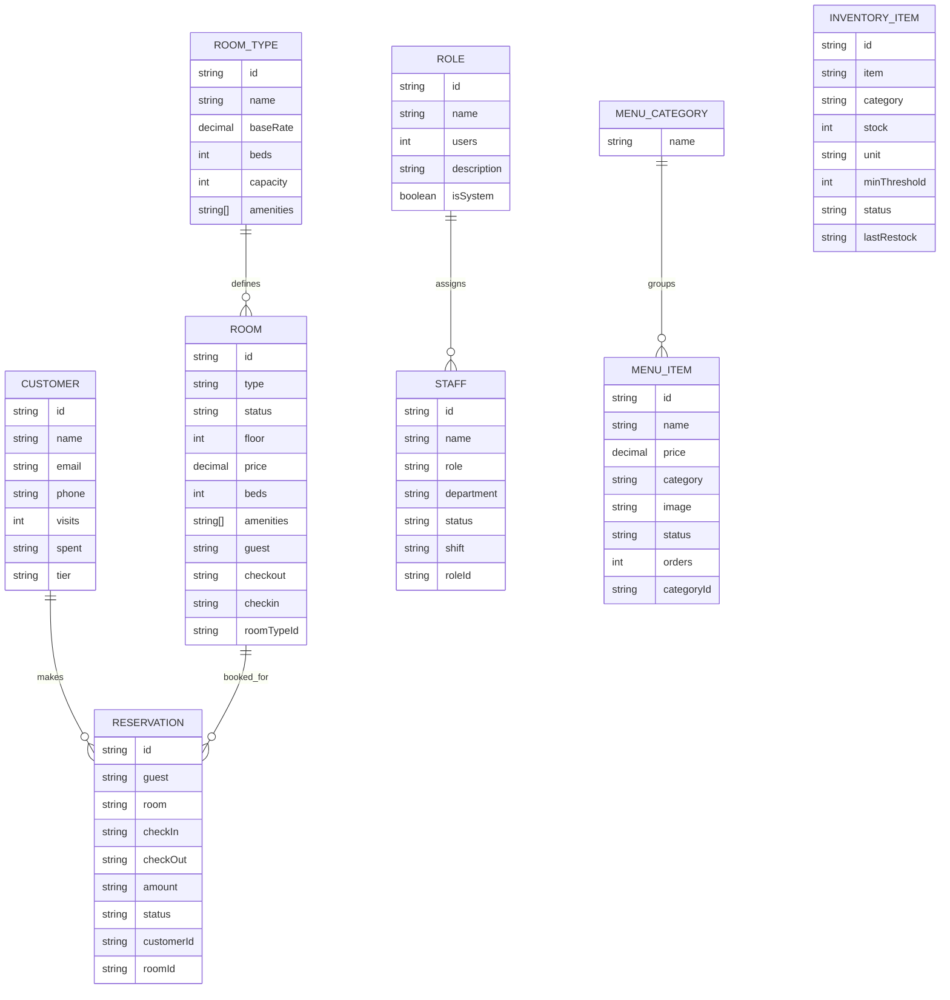

# Frontend-Inferred ER Diagram

This diagram is inferred from the frontend mock data and page models.

Notes:

- `roomTypeId`, `customerId`, `roomId`, `categoryId`, and `roleId` are inferred foreign keys that are not explicitly present in the current frontend mock data.
- The POS screen suggests order data, but there is no persisted order model in the frontend yet, so it is not included here.